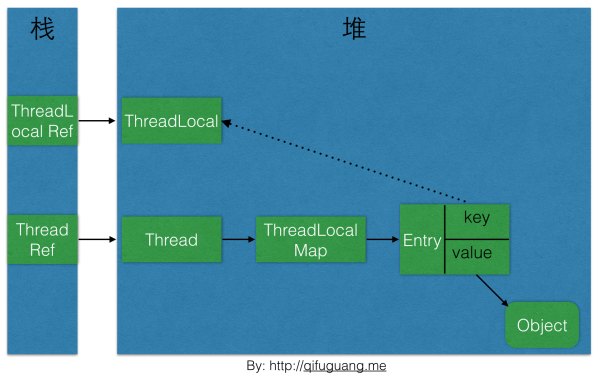
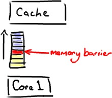
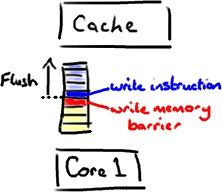

```
多线程共享变量的情况下，为了保证数据的一致性，往往需要对这些变量的访问进行加锁，
而锁的本身又会带来一些问题和开销。  

Immutable Object模式使得我们可以在不使用锁的情况下，既保证共享变量访问的线程安全
，又能避免引入锁可能带来的问题和开销。    

多线程环境下，一个对象常常会被多个线程共享。这种情况下，如果存在多个线程并发地
修改该对象的状态或者一个线程访问该对象的状态而另外一个线程试图修改该对象的状态，

我们不得不做一些同步访问控制以保证数据一致性。而这些同步访问控制，
如显式锁和CAS操作，会带来额外的开销和问题，如上下文切换，等待时间和ABA问题等。

Immutable Object模式的意图是通过使用对外可见的状态不可变的对象，
使得被共享对象"天生"具有线程安全性，而无须额外地同步访问控制。

从而既保证了数据一致性，又避免了同步访问控制所产生的额外开销和问题，也简化了编程。
所谓状态不可变的对象，即对象一经创建，其对外可见的状态就保持不变，

例如Java中的String和Integer。这点固然容易理解，
但还不足以知道我们在实际工作中运用Immutable Object模式。


Client           ImmutableObject       Manipulator

ImmutableObject :负责存储一组不可变状态。
该参与者不对外暴露任何可以修改其状态的方法，其主要方法及职责如下。
一个严格意义上不可变对象要满足以下所有条件。

１.类本身使用final修饰:防止其子类改变其定义的行为。

2. 所有字段都是用final修饰的:使用final修饰不仅仅是从语义上说明所修饰字段的引用
不可改变。更重要的是这个语义在多线程环境下由JMM保证了被修饰字段所引用对象的初始化
安全，即final修饰的字段在其他线程可见时,它必定是初始化完成的。
相反,非final修饰的字段由于缺少这种保证,可能导致一个线程"看到"一个字段的时候，
它还没有被初始化完成，从而可能导致一些不可预料的结果。

3.在对象的创建过程中,this关键字没有泄露给其他类:防止其他类在对象创建过程中
修改其状态。

４．任何字段,若其引用了其他状态可变的对象(如集合,数组等),则这些字段必须是
private修饰的，并且这些字段值不能对外暴露。
若其相关方法要返回这些字段值，应该进行防御性复制

Immutable Object模式特别适用于以下场景。

(1)被建模对象的状态变化不频繁
正如本章案例所展示的,这种场景下可以设置一个专门的线程(Manipulator参与者所在的
线程)用于在被建模对象状态变化时创建新的不可变对象。而其他线程则只是读取不可变对象
的状态。此场景下的一个小技巧是Manipulator对不可变对象的引用采用volatile关键字修饰，
既可以避免使用显示锁(synchronized),又可以保证多线程间的内存可见性。

(2)同时对一组相关的数据进行写操作，因此需要保证原子性：
此场景为了保证操作的原子性，通常的做法是使用显示锁。
但若采用Immutable Object模式，将这一组相关的数据"组合"成一个不可变对象，
则对这一组数据的操作就可以无须加显示锁也能保证原子性，这及简化了编程，
有提高了代码运行效率。本章开头所举的车辆位置跟踪的例子正是这种场景。

(3)使用某个对象作为安全的HashMap的Key:我们知道，
一个对象作为HashMap的key被"放入"HashMap之后，如该对象状态变化导致了其Hash 
Code的变化，则会导致后面在用同样的对象作为key去get的时候无法获取关联的值,
尽管该HashMap中的确存在以该对象为key的条目，相反，
由于不可变对象的状态不变，因此其Hash Code也不变。
这使得不可变对象非常适于用作HashMap的Key.


Guarded Suspension模式的核心是一个受保护方法。
该方法执行其所要真正执行的操作时需要满足特定的条件(Predicate,以下称之为保护条件)
。当该条件不满足时,执行受保护方法的线程会被挂起进入等待状态，
直达该条件满足时该线程才会继续运行。此时，受保护方法才会真正执行其所要执行的操作。
为方便起见，以下称受保护方法所要真正执行的操作为目标动作。


告警功能模块。

该模块的主要功能是将其接受到的告警信息发送给告警服务器。

该模块中的类AlarmAgent负责与告警服务器进行对接。

AlarmAgent的sendAlarm方法负责通过网络连接(Socket连接)将告警信息发送到告警服务器。

AlarmAgent创建了一个专门的线程用于其与告警服务器建立网路连接。
因此，sendAlarm方法被调用的时候,
连接线程可能还没有完成网络连接的建立。
此时,sendAlarm方法应该等待连接线程建立好网络连接。


另外，即便连接线程建立好了网络连接，中途也可能由于某些原因出现
与告警服务器断连的情况。此时,sendAlarm方法需要等待心跳(Heartbeat)任务重新建立好
连接才能上报告警信息。也就是说,sendAlarm方法必须在AlarmAgent与告警服务器
的网络连接建立成功的情况下才能执行其所要执行的操作。

若AlarmAgent与告警服务器的连接未建立(或者连接中断)，
sendAlarm方法的执行线程应该暂挂直到连接建立完毕(或者恢复)
```
## Java并发包学习
### 解密ThreadLocal
```
    ThreadLocal类用来提供线程内部的局部变量。这种变量在多线程环境下访问(通过get或set方法访问)时能保证各个线程里的变量相对
独立于其他线程内的变量。ThreadLocal实例通常来说都是private static类型的，用于关联线程和线程的上下文。
    可以总结为一句话:ThreadLocal的作用是提供线程内的局部变量，这种变量在线程的生命周期内起作用，减少同一个线程内多个函数
或者组件之间一些公共变量的传递的复杂度。 
    举个例子，我出门需要先坐公交再做地铁，这里的坐公交和坐地铁就好比是同一个线程内的两个函数，我就是一个线程，我要完成这
两个函数都需要同一个东西:公交卡(北京公交和地铁都使用公交卡)，那么我为了不向这两个函数都传递公交卡这个变量(相当于不是一直
带着公交卡上路)，我可以这么做:将公交卡事先交给一个机构，当我需要刷卡的时候再向这个机构要公交卡(当然每次拿的都是同一张公交
卡)。这样就能达到只要是我(同一个线程)需要公交卡，何时何地都能向这个机构要的目的。
    有人要说了:你可以将公交卡设置为全局变量啊，这样不是也能何时何地都能取公交卡吗?但是如果有很多个人(很多个线程)呢?大家可
不能都使用同一张公交卡吧(我们假设公交卡是实名认证的)，这样不就乱套了嘛。现在明白了吧？这就是ThreadLocal设计的初衷:提供线
程内部的局部变量，在本线程内随时随地可取，隔离其他线程。  
    ThreadLocal基本操作
    构造函数
    ThreadLocal的构造函数签名是这样的:
    public ThreadLocal(){}
    内部啥也没做。
    initialValue函数
    initialValue函数用来设置ThreadLocal的初始值，函数签名如下:
    protected T initialValue() {
            return null;
        }
    该函数在调用get函数的时候会第一次调用，但是如果一开始就调用了set函数，则该函数不会被调用。通常该函数只会被调用一次，
除非手动调用了remove函数之后又调用get函数，这种情况下，get函数中还是会调用initialValue函数。该函数是protected类型的，很
显然是建议在子类重载该函数的，所以通常该函数都会以匿名内部类的形式被重载，以指定初始值，比如: 
    public class TestThreadLocal {
        private static final ThreadLocal<Integer> value = new ThreadLocal<Integer>() {
            @Override
            protected Integer initialValue() {
                return Integer.valueOf(1);
            }
        };
    }
    get函数
    该函数用来获取与当前线程关联的ThreadLocal的值,函数签名如下:
    public T get()
    如果当前线程没有该ThreadLocal的值，则调用initialValue函数获取初始值返回。
    set函数
    set函数用来设置当前线程的该ThreadLocal的值，函数签名如下:
    public void set(T value)
    设置当前线程的ThreadLocal的值为value。
    remove函数
    remove函数用来将当前线程的ThreadLocal绑定的值删除，函数签名如下:
    public void remove()
    在某些情况下需要手动调用该函数，防止内存泄漏。
    
    如何实现的
    ThreadLocal的设计思路:
    每个Thread维护一个ThreadLocalMap映射表，这个映射表的Key是ThreadLocal实例本身,value是真正需要存储的Object。 
    然后网上就传言，ThreadLocal会引发内存泄露，他们的理由是这样的：如下图，ThreadLocalMap使用ThreadLocal的弱引用作为key，
如果一个ThreadLocal没有外部强引用引用他，那么系统gc的时候，这个ThreadLocal势必会被回收，这样一来，ThreadLocalMap中就会出
现key为null的Entry，就没有办法访问这些key为null的Entry的value，如果当前线程再迟迟不结束的话，这些key为null的Entry的value
就会一直存在一条强引用链：ThreadLocal Ref -> Thread -> ThreaLocalMap -> Entry -> value永远无法回收，造成内存泄露。

    整理一下ThreadLocalMap的getEntry函数的流程：首先从ThreadLocal的直接索引位置(通过ThreadLocal.threadLocalHashCode & 
(len-1)运算得到)获取Entry e，如果e不为null并且key相同则返回e；如果e为null或者key不一致则向下一个位置查询，如果下一个位置
的key和当前需要查询的key相等，则返回对应的Entry，否则，如果key值为null，则擦除该位置的Entry，否则继续向下一个位置查询在
这个过程中遇到的key为null的Entry都会被擦除，那么Entry内的value也就没有强引用链，自然会被回收。仔细研究代码可以发现，set
操作也有类似的思想，将key为null的这些Entry都删除，防止内存泄露。 但是光这样还是不够的，上面的设计思路依赖一个前提条件：
要调用ThreadLocalMap的genEntry函数或者set函数。这当然是不可能任何情况都成立的，所以很多情况下需要使用者手动调用ThreadLocal
的remove函数，手动删除不再需要的ThreadLocal，防止内存泄露。所以JDK建议将ThreadLocal变量定义成private static的，这样的话
ThreadLocal的生命周期就更长，由于一直存在ThreadLocal的强引用，所以ThreadLocal也就不会被回收，也就能保证任何时候都能根据
ThreadLocal的弱引用访问到Entry的value值，然后remove它，防止内存泄露。               
```
<p align="center"></p>

### 深度剖析ConcurrentHashMap

- Java内存模型
        java并发采用的是共享内存模型，线程之间的通信对程序员来说是透明的，内存可见性问题很容易困扰着java程序员，今天我们
        就来揭开java内存模型的神秘面纱。
        ***
        在揭开面纱之前，我们需要认识几个基础概念：内存屏障（memory Barriers），指令重排序，happens-before规则，
        as-if-serial语义。
什么是Memory Barrier(内存屏障)?
        内存屏障，又称内存栅栏，是一个CPU指令，基本上它是一条这样的指令：
        1、保证特定操作的执行顺序。
        2、影响某些数据（或则是某条指令的执行结果）的内存可见性。
        编译器和CPU能够重排序指令，保证最终相同的结果，尝试优化性能。插入一条Memory Barrier会告诉编译器和CPU：不管什么指令
        都不能和这条Memory Barrier指令重排序。
        Memory Barrier所做的另外一件事是强制刷出各种CPU cache，如一个 Write-Barrier（写入屏障）将刷出所有在 Barrier 之前
        写入 cache 的数据，因此，任何CPU上的线程都能读取到这些数据的最新版本。见下图
        这和java有什么关系？volatile是基于Memory Barrier实现的。
        如果一个变量是volatile修饰的，JMM会在写入这个字段之后插进一个Write-Barrier指令，并在读这个字段之前插入一个
        Read-Barrier指令。见下图
        这意味着，如果写入一个volatile变量a，可以保证：
        1、一个线程写入变量a后，任何线程访问该变量都会拿到最新值。
        2、在写入变量a之前的写入操作，其更新的数据对于其他线程也是可见的。因为Memory Barrier会刷出cache中的所有先前的写入。
happens-before
        从jdk5开始，java使用新的JSR-133内存模型，基于happens-before的概念来阐述操作之间的内存可见性。
        在JMM中，如果一个操作的执行结果需要对另一个操作可见，那么这两个操作之间必须要存在happens-before关系，这个的两个
        操作既可以在同一个线程，也可以在不同的两个线程中。
        与程序员密切相关的happens-before规则如下：
        1、程序顺序规则：一个线程中的每个操作，happens-before于该线程中任意的后续操作。
        2、监视器锁规则：对一个锁的解锁操作，happens-before于随后对这个锁的加锁操作。
        3、volatile域规则：对一个volatile域的写操作，happens-before于任意线程后续对这个volatile域的读。
        4、传递性规则：如果 A happens-before B，且 B happens-before C，那么A happens-before C。
        注意：两个操作之间具有happens-before关系，并不意味前一个操作必须要在后一个操作之前执行！仅仅要求前一个操作的执行
        结果，对于后一个操作是可见的，且前一个操作按顺序排在后一个操作之前。
指令重排序
        在执行程序时，为了提高性能，编译器和处理器会对指令做重排序。但是，JMM确保在不同的编译器和不同的处理器平台之上，
        通过插入特定类型的Memory Barrier来禁止特定类型的编译器重排序和处理器重排序，为上层提供一致的内存可见性保证。
        1、编译器优化重排序：编译器在不改变单线程程序语义的前提下，可以重新安排语句的执行顺序。
        2、指令级并行的重排序：如果不存在数据依赖性，处理器可以改变语句对应机器指令的执行顺序。
        3、内存系统的重排序：处理器使用缓存和读写缓冲区，这使得加载和存储操作看上去可能是在乱序执行。
        数据依赖性
        如果两个操作访问同一个变量，其中一个为写操作，此时这两个操作之间存在数据依赖性。
        编译器和处理器不会改变存在数据依赖性关系的两个操作的执行顺序，即不会重排序。
as-if-serial
        不管怎么重排序，单线程下的执行结果不能被改变，编译器、runtime和处理器都必须遵守as-if-serial语义。
抽象结构
        java线程之间的通信由java内存模型（JMM）控制，JMM决定一个线程对共享变量（实例域、静态域和数组）的写入何时对其它
        线程可见。
        从抽象的角度来看，JMM定义了线程和主内存Main Memory（堆内存）之间的抽象关系：线程之间的共享变量存储在主内存中，
        每个线程都有自己的本地内存Local Memory（只是一个抽象概念，物理上不存在），存储了该线程的共享变量副本。   
        所以，线程A和线程B之前需要通信的话，必须经过一下两个步骤：
        1、线程A把本地内存中更新过的共享变量刷新到主内存中。
        2、线程B到主内存中读取线程A之前更新过的共享变量。

<p align="center"></p>
<p align="center"></p>

- Java中的Unsafe
```
前言
    Java最初被设计为一种安全的受控环境。尽管如此，HotSpot还是包含了一个后门sun.misc.Unsafe，提供了一些可以直接操控内存和
线程的底层操作。Unsafe被JDK广泛应用于java.nio和并发包等实现中，这个不安全的类提供了一个观察HotSpot JVM内部结构并且可以对
其进行修改，但是不建议在生产环境中使用。
```
- Java中的CAS
- 深入浅出Java同步器
- 深入浅出ReentrantLock

```
    HashMap是非线程安全的，HashTable是线程安全的。
    今天我们将深入剖析一个比HashTable性能更优的线程安全的Map类，它就是ConcurrentHashMap，本文基于Java 7的源码做剖析。
    -+->ConcurrentHashMap的目的<-+-
    多线程环境下，使用Hashmap进行put操作会引起死循环，导致CPU利用率接近100%，所以在并发情况下不能使用HashMap。虽然已经有
一个线程安全的HashTable，但是HashTable容器使用synchronized（他的get和put方法的实现代码如下）来保证线程安全，在线程竞争激
烈的情况下HashTable的效率非常低下。因为当一个线程访问HashTable的同步方法时，访问其他同步方法的线程就可能会进入阻塞或者轮
训状态。如线程1使用put进行添加元素，线程2不但不能使用put方法添加元素，并且也不能使用get方法来获取元素，所以竞争越激烈效率
越低。
public synchronized V get(Object key) {
    Entry<?,?> tab[] = table;
    int hash = key.hashCode();
    int index = (hash & 0x7FFFFFFF) % tab.length;
    for (Entry<?,?> e = tab[index] ; e != null ; e = e.next) {
        if ((e.hash == hash) && e.key.equals(key)) {
            return (V)e.value;
        }
    }
    return null;
}
public synchronized V put(K key, V value) {
    // Make sure the value is not null
    if (value == null) {
        throw new NullPointerException();
    }

    // Makes sure the key is not already in the hashtable.
    Entry<?,?> tab[] = table;
    int hash = key.hashCode();
    int index = (hash & 0x7FFFFFFF) % tab.length;
    @SuppressWarnings("unchecked")
    Entry<K,V> entry = (Entry<K,V>)tab[index];
    for(; entry != null ; entry = entry.next) {
        if ((entry.hash == hash) && entry.key.equals(key)) {
            V old = entry.value;
            entry.value = value;
            return old;
        }
    }

    addEntry(hash, key, value, index);
    return null;
}
在这么恶劣的环境下，ConcurrentHashMap应运而生。
  -+->ConcurrentHashMap实现原理<-+-
  ConcurrentHashMap使用分段锁技术，将数据分成一段一段的存储，然后给每一段数据配一把锁，当一个线程占用锁访问其中一个段数
据的时候，其他段的数据也能被其他线程访问，能够实现真正的并发访问。如下图是ConcurrentHashMap的内部结构图：

    从图中可以看到，ConcurrentHashMap内部分为很多个Segment，每一个Segment拥有一把锁，然后每个Segment（继承ReentrantLock）
下面包含很多个HashEntry列表数组。对于一个key，需要经过三次（为什么要hash三次下文会详细讲解）hash操作，才能最终定位这个元
素的位置，这三次hash分别为：
                            对于一个key，先进行一次hash操作，得到hash值h1，也即h1 = hash1(key)；
                            将得到的h1的高几位进行第二次hash，得到hash值h2，也即h2 = hash2(h1高几位)，通过h2能够确定该元素
                            的放在哪个Segment；
                            将得到的h1进行第三次hash，得到hash值h3，也即h3 = hash3(h1)，通过h3能够确定该元素放置在哪个
                            HashEntry。
  -+->ConcurrentHashMap初始化<-+-                            
```
<p align="center"></p>


