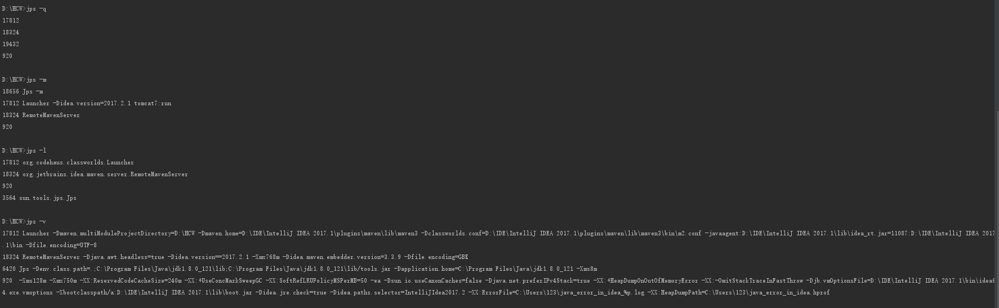
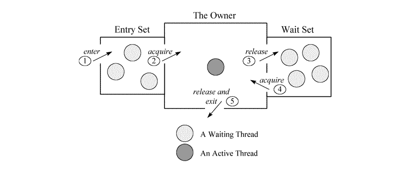

# 参考书籍  　　
- Java多线程编程实战指南(设计模式篇)  　　
- Java Concurrency in Practice
- Java 7 Concurrency Cookbook  
- 深入理解Java虚拟机

# Java工具
- jps

```
描述
    jps位于jdk的bin目录下，其作用是显示当前系统的java进程情况，及其id号。 jps相当于Solaris进程工具ps。不象”pgrep java”
或”ps -ef grep java”，jps并不使用应用程序名来查找JVM实例。因此，它查找所有的Java应用程序，包括即使没有使用java执行体的
那种（例如，定制的启动 器）。另外，jps仅查找当前用户的Java进程，而不是当前系统中的所有进程。

位置

    我们知道，很多Java命令都在jdk的JAVA_HOME/bin/目录下面，jps也不例外，他就在bin目录下，所以，他是java自带的一个命令。

功能

    jps(Java Virtual Machine Process Status Tool)是JDK 1.5提供的一个显示当前所有java进程pid的命令，简单实用，非常适合在
linux/unix平台上简单察看当前java进程的一些简单情况。
 原理

    jdk中的jps命令可以显示当前运行的java进程以及相关参数，它的实现机制如下：
    java程序在启动以后，会在java.io.tmpdir指定的目录下，就是临时文件夹里，生成一个类似于hsperfdata_User的文件夹，这个文件
夹里（在Linux中为/tmp/hsperfdata_{userName}/），有几个文件，名字就是java进程的pid，因此列出当前运行的java进程，只是把这个
目录里的文件名列一下而已。 至于系统的参数什么，就可以解析这几个文件获得。

 使用
    -q 只显示pid，不显示class名称,jar文件名和传递给main 方法的参数
    -m 输出传递给main 方法的参数，在嵌入式jvm上可能是null， 在这里，在启动main方法的时候，我给String[] args传递两个参数。
hollis,chuang,执行jsp -m:
    -l 输出应用程序main class的完整package名 或者 应用程序的jar文件完整路径名
    -v 输出传递给JVM的参数 在这里，在启动main方法的时候，我给jvm传递一个参数：-Dfile.encoding=UTF-8,执行jps -v：
    PS:jps命令有个地方很不好，似乎只能显示当前用户的java进程，要显示其他用户的还是只能用unix/linux的ps命令。
    jps是我最常用的java命令。使用jps可以查看当前有哪些Java进程处于运行状态。如果我运行了一个web应用（使用tomcat、jboss、
jetty等启动）的时候，我就可以使用jps查看启动情况。有的时候我想知道这个应用的日志会输出到哪里，或者启动的时候使用了哪些
javaagent，那么我可以使用jps -v 查看进程的jvm参数情况。

 JPS失效处理
    现象： 用ps -ef|grep java能看到启动的java进程，但是用jps查看却不存在该进程的id。待会儿解释过之后就能知道在该情况下，
jconsole、jvisualvm可能无法监控该进程，其他java自带工具也可能无法使用分析： jps、jconsole、jvisualvm等工具的数据来源就是
这个文件（/tmp/hsperfdata_userName/pid)。所以当该文件不存在或是无法读取时就会出现jps无法查看该进程号，jconsole无法监控等问题
    原因：
    （1）、磁盘读写、目录权限问题 若该用户没有权限写/tmp目录或是磁盘已满，则无法创建/tmp/hsperfdata_userName/pid文件。
或该文件已经生成，但用户没有读权限
    （2）、临时文件丢失，被删除或是定期清理 对于linux机器，一般都会存在定时任务对临时文件夹进行清理，导致/tmp目录被清空。
这也是我第一次碰到该现象的原因。常用的可能定时删除临时目录的工具为crontab、redhat的tmpwatch、ubuntu的tmpreaper等等这个导
致的现象可能会是这样，用jconsole监控进程，发现在某一时段后进程仍然存在，但是却没有监控信息了。
    （3）、java进程信息文件存储地址被设置，不在/tmp目录下 上面我们在介绍时说默认会在/tmp/hsperfdata_userName目录保存进程
信息，但由于以上1、2所述原因，可能导致该文件无法生成或是丢失，所以java启动时提供了参数(-Djava.io.tmpdir)，可以对这个文件
的位置进行设置，而jps、jconsole都只会从/tmp目录读取，而无法从设置后的目录读物信息，这是我第二次碰到该现象的原因
    附：
    1.如何给main传递参数 在eclipse中，鼠标右键->Run As->Run COnfiguations->Arguments->在Program arguments中写下要传的参数值
    2.如何给JVM传递参数 在eclipse中，鼠标右键->Run As->Run COnfiguations->Arguments->在VM arguments中写下要传的参数值
（一般以-D开头）
```
<p align="center"></p>

- Jstack
```
描述
    jstack是java虚拟机自带的一种堆栈跟踪工具。

 功能
    jstack用于生成java虚拟机当前时刻的线程快照。线程快照是当前java虚拟机内每一条线程正在执行的方法堆栈的集合，生成线程快照
的主要目的是定位线程出现长时间停顿的原因，如线程间死锁、死循环、请求外部资源导致的长时间等待等。 线程出现停顿的时候通过
jstack来查看各个线程的调用堆栈，就可以知道没有响应的线程到底在后台做什么事情，或者等待什么资源。 如果java程序崩溃生成
core文件，jstack工具可以用来获得core文件的java stack和native stack的信息，从而可以轻松地知道java程序是如何崩溃和在程序何处
发生问题。另外，jstack工具还可以附属到正在运行的java程序中，看到当时运行的java程序的java stack和native stack的信息,
如果现在运行的java程序呈现hung的状态，jstack是非常有用的。
    So,jstack命令主要用来查看Java线程的调用堆栈的，可以用来分析线程问题（如死锁）。
线程状态
    想要通过jstack命令来分析线程的情况的话，首先要知道线程都有哪些状态，下面这些状态是我们使用jstack命令查看线程堆栈信息
时可能会看到的线程的几种状态：
    NEW,未启动的。不会出现在Dump中。
    RUNNABLE,在虚拟机内执行的。
    BLOCKED,受阻塞并等待监视器锁。
    WATING,无限期等待另一个线程执行特定操作。
   TIMED_WATING,有时限的等待另一个线程的特定操作。
   TERMINATED,已退出的。
Monitor
    在多线程的 JAVA程序中，实现线程之间的同步，就要说说 Monitor。 Monitor是 Java中用以实现线程之间的互斥与协作的主要手段，
它可以看成是对象或者 Class的锁。每一个对象都有，也仅有一个 monitor。图1，描述了线程和 Monitor之间关系，以 及线程
的状态转换图：
    进入区(Entrt Set):
    表示线程通过synchronized要求获取对象的锁。如果对象未被锁住,则迚入拥有者;否则则在进入区等待。一旦对象锁被其他线程释放,
立即参与竞争。
    拥有者(The Owner):
    表示某一线程成功竞争到对象锁。
    等待区(Wait Set):
    表示线程通过对象的wait方法,释放对象的锁,并在等待区等待被唤醒。
    从下图可以看出，一个 Monitor在某个时刻，只能被一个线程拥有，该线程就是 “Active Thread”，而其它线程都是 
“Waiting Thread”，分别在两个队列 “ Entry Set”和 “Wait Set”里面等候。在 “Entry Set”中等待的线程状态是 “Waiting 
for monitor entry”，而在 “Wait Set”中等待的线程状态是 “in Object.wait()”。 先看 “Entry Set”里面的线程。我们称被 
synchronized保护起来的代码段为临界区。当一个线程申请进入临界区时，它就进入了 “Entry Set”队列。
调用修饰
    表示线程在方法调用时,额外的重要的操作。线程Dump分析的重要信息。修饰上方的方法调用。
    locked <地址> 目标：使用synchronized申请对象锁成功,监视器的拥有者。
    waiting to lock <地址> 目标：使用synchronized申请对象锁未成功,在迚入区等待。
    waiting on <地址> 目标：使用synchronized申请对象锁成功后,释放锁幵在等待区等待。
    parking to wait for <地址> 目标
线程Dump的分析
    原则
    结合代码阅读的推理。需要线程Dump和源码的相互推导和印证。
    造成Bug的根源往往丌会在调用栈上直接体现,一定格外注意线程当前调用之前的所有调用。
入手点
    进入区等待
    线程状态BLOCKED,线程动作wait on monitor entry,调用修饰waiting to lock总是一起出现。表示在代码级别已经存在冲突的调用。
必然有问题的代码,需要尽可能减少其发生。
    同步块阻塞
    一个线程锁住某对象,大量其他线程在该对象上等待。
    持续运行的IO IO操作是可以以RUNNABLE状态达成阻塞。例如:数据库死锁、网络读写。 格外注意对IO线程的真实状态的分析。
一般来说,被捕捉到RUNNABLE的IO调用,都是有问题的。
    以下堆栈显示：
     线程状态为RUNNABLE。 调用栈在SocketInputStream或SocketImpl上,socketRead0等方法。 调用栈包含了jdbc相关的包。很可能
发生了数据库死锁
    分线程调度的休眠
正常的线程池等待
可疑的线程等待

------入手点总结------
Wait on monitor entry : 被组塞的，肯定有问题
runnable              :注意IO线程
in Object.wait()      ：注意非线程池等待
   
使用
    -F 当’jstack [-l] pid’没有相应的时候强制打印栈信息
    -l 长列表. 打印关于锁的附加信息,例如属于java.util.concurrent的ownable synchronizers列表. 
    -m 打印java和native c/c++框架的所有栈信息. 
    -h | -help打印帮助信息 
    pid 需要被打印配置信息的java进程id,可以用jps查询.    
---step1---
先是有jps查看进程号：
hollis@hos:~$ jps
29788 JStackDemo1
29834 Jps
22385 org.eclipse.equinox.launcher_1.3.0.v20130327-1440.jar
---step2---  
然后使用jstack 查看堆栈信息：  
hollis@hos:~$ jstack 29788
2015-04-17 23:47:31
...此处省略若干内容...
"main" prio=10 tid=0x00007f197800a000 nid=0x7462 runnable [0x00007f197f7e1000]
   java.lang.Thread.State: RUNNABLE
    at javaCommand.JStackDemo1.main(JStackDemo1.java:7)
其他
虚拟机执行Full GC时,会阻塞所有的用户线程。因此,即时获取到同步锁的线程也有可能被阻塞。 在查看线程Dump时,首先查看内存使用情况。    
```
<p align="center"></p>

- Jmap
```
描述
    jmap是JDK自带的工具软件，主要用于打印指定Java进程(或核心文件、远程调试服务器)的共享对象内存映射或堆内存细节。可以使用jmap生成Heap
Dump。
什么是堆Dump
    堆Dump是反应Java堆使用情况的内存镜像，其中主要包括系统信息、虚拟机属性、完整的线程Dump、所有类和对象的状态等。 一般，在内存不足、
GC异常等情况下，我们就会怀疑有内存泄露。这个时候我们就可以制作堆Dump来查看具体情况。分析原因。
基础知识
    outOfMemoryError 年老代内存不足。
    outOfMemoryError:PermGen Space 永久代内存不足。
    outOfMemoryError:GC overhead limit exceed 垃圾回收时间占用系统运行时间的98%或以上。
用法摘要
Terminal jmap打印log:    
Usage:
    jmap [option] <pid>
        (to connect to running process)
    jmap [option] <executable <core>
        (to connect to a core file)
    jmap [option] [server_id@]<remote server IP or hostname>
        (to connect to remote debug server)

where <option> is one of:
    <none>               to print same info as Solaris pmap
    -heap                to print java heap summary
    -histo[:live]        to print histogram of java object heap; if the "live"
                         suboption is specified, only count live objects
    -clstats             to print class loader statistics
    -finalizerinfo       to print information on objects awaiting finalization
    -dump:<dump-options> to dump java heap in hprof binary format
                         dump-options:
                           live         dump only live objects; if not specified,
                                        all objects in the heap are dumped.
                           format=b     binary format
                           file=<file>  dump heap to <file>
                         Example: jmap -dump:live,format=b,file=heap.bin <pid>
    -F                   force. Use with -dump:<dump-options> <pid> or -histo
                         to force a heap dump or histogram when <pid> does not
                         respond. The "live" suboption is not supported
                         in this mode.
    -h | -help           to print this help message
    -J<flag>             to pass <flag> directly to the runtime system

参数
    option 选项参数是互斥的(不可同时使用)。想要使用选项参数，直接跟在命令名称后即可。
    pid 需要打印配置信息的进程ID。该进程必须是一个Java进程。想要获取运行的Java进程列表，你可以使用jps。
    executable 产生核心dump的Java可执行文件。
    core 需要打印配置信息的核心文件。
    remote-hostname-or-IP 远程调试服务器的(请查看jsadebugd)主机名或IP地址。
    server-id 可选的唯一id，如果相同的远程主机上运行了多台调试服务器，用此选项参数标识服务器。
选项   
    <no option> 如果使用不带选项参数的jmap打印共享对象映射，将会打印目标虚拟机中加载的每个共享对象的起始地址、映射大小以及共享对象文件
    的路径全称。这与Solaris的pmap工具比较相似。
    -dump:[live,]format=b,file=<filename> 以hprof二进制格式转储Java堆到指定filename的文件中。live子选项是可选的。如果指定了live
    子选项，堆中只有活动的对象会被转储。想要浏览heap dump，你可以使用jhat(Java堆分析工具)读取生成的文件。
    -finalizerinfo 打印等待终结的对象信息。
    -heap 打印一个堆的摘要信息，包括使用的GC算法、堆配置信息和generation wise heap usage。
    -histo[:live] 打印堆的柱状图。其中包括每个Java类、对象数量、内存大小(单位：字节)、完全限定的类名。打印的虚拟机内部的类名称将会带有
     一个’*’前缀。如果指定了live子选项，则只计算活动的对象。
    -permstat 打印Java堆内存的永久保存区域的类加载器的智能统计信息。对于每个类加载器而言，它的名称、活跃度、地址、父类加载器、它所加载
    的类的数量和大小都会被打印。此外，包含的字符串数量和大小也会被打印。
    -F 强制模式。如果指定的pid没有响应，请使用jmap -dump或jmap -histo选项。此模式下，不支持live子选项。
    -h 打印帮助信息。
    -help 打印帮助信息。
    -J<flag> 指定传递给运行jmap的JVM的参数。
    
查看java堆(heap)使用情况,执行命令: jmap -heap 31846
Attaching to process ID 31846, please wait...
Debugger attached successfully.
Server compiler detected.
JVM version is 24.71-b01

using thread-local object allocation.
Parallel GC with 4 thread(s)//GC 方式

Heap Configuration: //堆内存初始化配置
   MinHeapFreeRatio = 0 //对应jvm启动参数-XX:MinHeapFreeRatio设置JVM堆最小空闲比率(default 40)
   MaxHeapFreeRatio = 100 //对应jvm启动参数 -XX:MaxHeapFreeRatio设置JVM堆最大空闲比率(default 70)
   MaxHeapSize      = 2082471936 (1986.0MB) //对应jvm启动参数-XX:MaxHeapSize=设置JVM堆的最大大小
   NewSize          = 1310720 (1.25MB)//对应jvm启动参数-XX:NewSize=设置JVM堆的‘新生代’的默认大小
   MaxNewSize       = 17592186044415 MB//对应jvm启动参数-XX:MaxNewSize=设置JVM堆的‘新生代’的最大大小
   OldSize          = 5439488 (5.1875MB)//对应jvm启动参数-XX:OldSize=<value>:设置JVM堆的‘老生代’的大小
   NewRatio         = 2 //对应jvm启动参数-XX:NewRatio=:‘新生代’和‘老生代’的大小比率
   SurvivorRatio    = 8 //对应jvm启动参数-XX:SurvivorRatio=设置年轻代中Eden区与Survivor区的大小比值 
   PermSize         = 21757952 (20.75MB)  //对应jvm启动参数-XX:PermSize=<value>:设置JVM堆的‘永生代’的初始大小
   MaxPermSize      = 85983232 (82.0MB)//对应jvm启动参数-XX:MaxPermSize=<value>:设置JVM堆的‘永生代’的最大大小
   G1HeapRegionSize = 0 (0.0MB)

Heap Usage://堆内存使用情况
PS Young Generation
Eden Space://Eden区内存分布
   capacity = 33030144 (31.5MB)//Eden区总容量
   used     = 1524040 (1.4534378051757812MB)  //Eden区已使用
   free     = 31506104 (30.04656219482422MB)  //Eden区剩余容量
   4.614088270399305% used //Eden区使用比率
From Space:  //其中一个Survivor区的内存分布
   capacity = 5242880 (5.0MB)
   used     = 0 (0.0MB)
   free     = 5242880 (5.0MB)
   0.0% used
To Space:  //另一个Survivor区的内存分布
   capacity = 5242880 (5.0MB)
   used     = 0 (0.0MB)
   free     = 5242880 (5.0MB)
   0.0% used
PS Old Generation //当前的Old区内存分布
   capacity = 86507520 (82.5MB)
   used     = 0 (0.0MB)
   free     = 86507520 (82.5MB)
   0.0% used
PS Perm Generation//当前的 “永生代” 内存分布
   capacity = 22020096 (21.0MB)
   used     = 2496528 (2.3808746337890625MB)
   free     = 19523568 (18.619125366210938MB)
   11.337498256138392% used

670 interned Strings occupying 43720 bytes.

查看堆内存(histogram)中的对象数量及大小。
执行命令： hollis@hos:~/workspace/design_apaas/apaasweb/control/bin$ jmap -histo 3331
num     #instances         #bytes  class name
编号     个数                字节     类名
----------------------------------------------
   1:             7        1322080  [I
   2:          5603         722368  <methodKlass>
   3:          5603         641944  <constMethodKlass>
   4:         34022         544352  java.lang.Integer
   5:           371         437208  <constantPoolKlass>
   6:           336         270624  <constantPoolCacheKlass>
   7:           371         253816  <instanceKlassKlass>

jmap -histo:live 这个命令执行，JVM会先触发gc，然后再统计信息。   

将内存使用的详细情况输出到文件，
执行命令： hollis@hos:~/workspace/design_apaas/apaasweb/control/bin$ jmap -dump:format=b,file=heapDump 6900
然后用jhat命令可以参看 jhat -port 5000 heapDump 在浏览器中访问：http://localhost:5000/ 查看详细信息
这个命令执行，JVM会将整个heap的信息dump写入到一个文件，heap如果比较大的话，就会导致这个过程比较耗时，
并且执行的过程中为了保证dump的信息是可靠的，所以会暂停应用。

总结
1.如果程序内存不足或者频繁GC，很有可能存在内存泄露情况，这时候就要借助Java堆Dump查看对象的情况。
2.要制作堆Dump可以直接使用jvm自带的jmap命令
3.可以先使用jmap -heap命令查看堆的使用情况，看一下各个堆空间的占用情况。
4.使用jmap -histo:[live]查看堆内存中的对象的情况。如果有大量对象在持续被引用，并没有被释放掉，那就产生了内存泄露，
就要结合代码，把不用的对象释放掉。
5.也可以使用 jmap -dump:format=b,file=<fileName>命令将堆信息保存到一个文件中，再借助jhat命令查看详细内容
6.在内存出现泄露、溢出或者其它前提条件下，建议多dump几次内存，把内存文件进行编号归档，便于后续内存整理分析。

Error attaching to process: sun.jvm.hotspot.debugger.DebuggerException: Can’t attach to the process
在ubuntu中第一次使用jmap会报错：Error attaching to process: sun.jvm.hotspot.debugger.DebuggerException: 
Can't attach to the process，这是oracla文档中提到的一个bug:http://bugs.java.com/bugdatabase/view_bug.do?bug_id=7050524,
解决方式如下：
echo 0 | sudo tee /proc/sys/kernel/yama/ptrace_scope 该方法在下次重启前有效。
永久有效方法 sudo vi /etc/sysctl.d/10-ptrace.conf 编辑下面这行: kernel.yama.ptrace_scope = 1 
修改为: kernel.yama.ptrace_scope = 0 重启系统，使修改生效。
   
```
- TProfiler介绍

```
    TProfiler是一个可以在生产环境长期使用的性能分析工具.它同时支持剖析和采样两种方式,记录方法执行的时间和次数,生成方法热
点对象创建热点 线程状态分析等数据,为查找系统性能瓶颈提供数据支持.
TProfiler在JVM启动时把时间采集程序注入到字节码中,整个过程无需修改应用源码.运行时会把数据写到日志文件,一般情况下每小时
输出的日志小于50M.
业界同类开源产品都不是针对大型Web应用设计的,对性能消耗较大不能长期使用,TProfiler解决了这个问题.目前TProfiler已应用于淘宝
的核心Java前端系统.
部署后低峰期对应用响应时间影响20% 高峰期对吞吐量大约有30%的降低(高峰期可以远程关闭此工具)
```

<table>
   <tr>
      <td></td>
      <td>与同类开源工具jip对比</td>
      <td></td>
   </tr>
   <tr>
      <td>项目</td>
      <td>TProfiler</td>
      <td>JIP</td>
   </tr>
   <tr>
      <td>交互控制</td>
      <td>支持远程开关和状态查看</td>
      <td>支持远程开关等多种操作</td>
   </tr>
   <tr>
      <td>过滤包和类名</td>
      <td>支持包和类的过滤</td>
      <td>支持包和类的过滤</td>
   </tr>
   <tr>
      <td>低消耗</td>
      <td>响应时间延长20% QPS降低30%(详细对比看上图)</td>
      <td>同等条件下资源消耗较多,使JVM不断的FullGC;Profile时会阻塞其他线程</td>
   </tr>
   <tr>
      <td>无本地代码</td>
      <td>未使用JVMTI,纯Java开发</td>
      <td>未使用JVMTI,纯Java开发</td>
   </tr>
   <tr>
      <td>易用性</td>
      <td>只有一个jar包,使用简单</td>
      <td>模块多,配置使用相对复杂</td>
   </tr>
   <tr>
      <td>日志文件</td>
      <td>对日志进行优化,每小时一般小于50M</td>
      <td>同等条件下日志大约是TProfiler的8倍,不能自动dump需要客户端触发</td>
   </tr>
   <tr>
      <td>日志分析</td>
      <td>目前只提供文本展示</td>
      <td>可以利用客户端分析展示日志</td>
   </tr>
   <tr>
      <td>使用场景</td>
      <td>大型应用/小型应用 长期使用</td>
      <td>小型应用 短期使用</td>
   </tr>
   <tr>
      <td></td>
   </tr>
</table>


